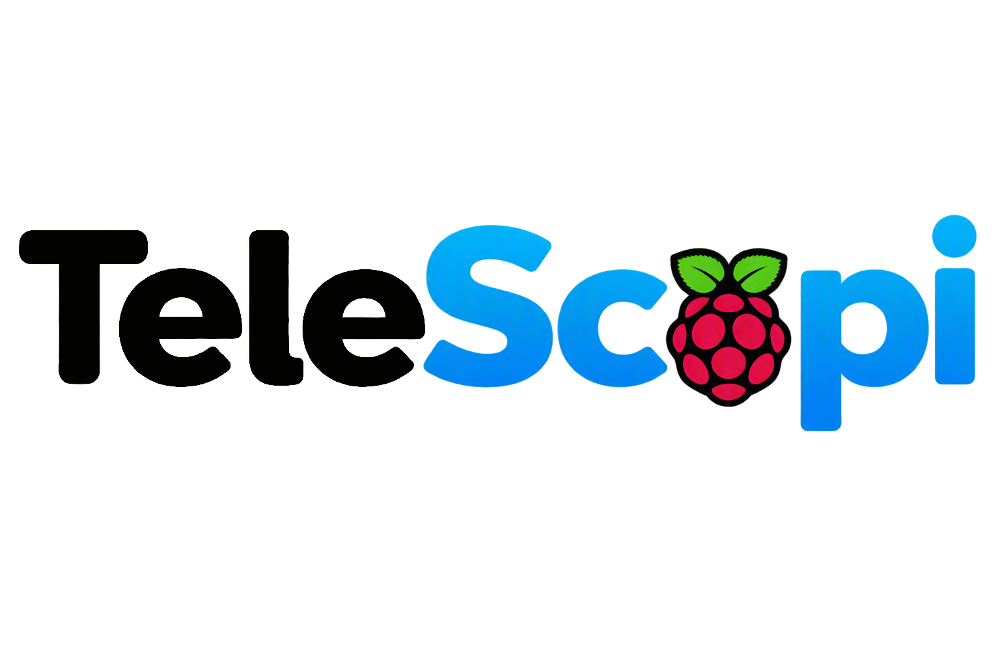

# TeleScopi - Raspberry project

## Description générale

TeleScopi est un projet python de **surveillance domestique** utilisant une caméra reliée à un Raspberry Pi pilotable à distance depuis Telegram. Il détecte les mouvements, avertit les utilisateurs autorisés et leur permet de demander à la demande des photos ou des vidéos.

## Fonctionnalités

### Fonctionnalités principales

- Détection automatique des mouvements, avec adaptation de la détection à la luminosité ambiante (réglages distincts pour le jour et la nuit)
- Envoi d’une alerte Telegram lors d’une détection de mouvement incluant une photo (avec mise en évidence de la zone détectée) puis une vidéo enregistrées automatiquement
- Activation/Désactivation de la détection de mouvement via Telegram
- Prise de photo à la demande via Telegram
- Enregistrement vidéo à la demande via Telegram
- Envoi quotidien d’un message Telegram pour surveiller le bon fonctionnement du système
- Communications via Telegram réservées aux utilisateurs explicitement autorisés
- Personnalisation de la configuration (sensibilité de la détection de mouvement, durée des vidéos, ...)

### Gestion des cas d'erreur

- Stockage temporaire des photos/vidéos en cas d'erreur de transfert
- Conservation des photos/vidéos en attente après un redémarrage
- Conservation des logs après un redémarrage
- Nouvelle tentative d'envoi automatique des photos/vidéos non transmis
- Redémarrage automatique du service en cas de problème
- Nettoyage automatique des anciens fichiers si l'espace disque devient insuffisant ou si les fichiers sont trop anciens

## Matériel nécessaire

Ce projet a été testé avec :

- Raspberry Pi 3 model B [lien](https://www.raspberrypi.com/products/raspberry-pi-3-model-b/)
- Raspberry Pi Camera Module v2 NoIR [lien](https://www.raspberrypi.com/products/pi-noir-camera-v2/)
- Raspberry Pi OS Lite (64-bit)
- Carte microSD 32 Go, classe 10

## Installation

Pour installer le projet, suivez les étapes de [la documentation d'installation](./docs/installation.md).

## Configuration

Pour configurer le projet, suivez les étapes de [la documentation de configuration](./docs/configuration.md).

## Utilisation

Pour vous aidez à utiliser TeleScoPi, lisez [la documentation d'utilisation](./docs/utilisation.md).

## Implémentation

Pour implémenter le projet, prenez connaissance des informations de [la documentation d'implémentation](./docs/implementation.md).

> [!NOTE]
> Les migrations et implémentations de ce projet ont été assistées par IA (principalement Claude Sonnet).
